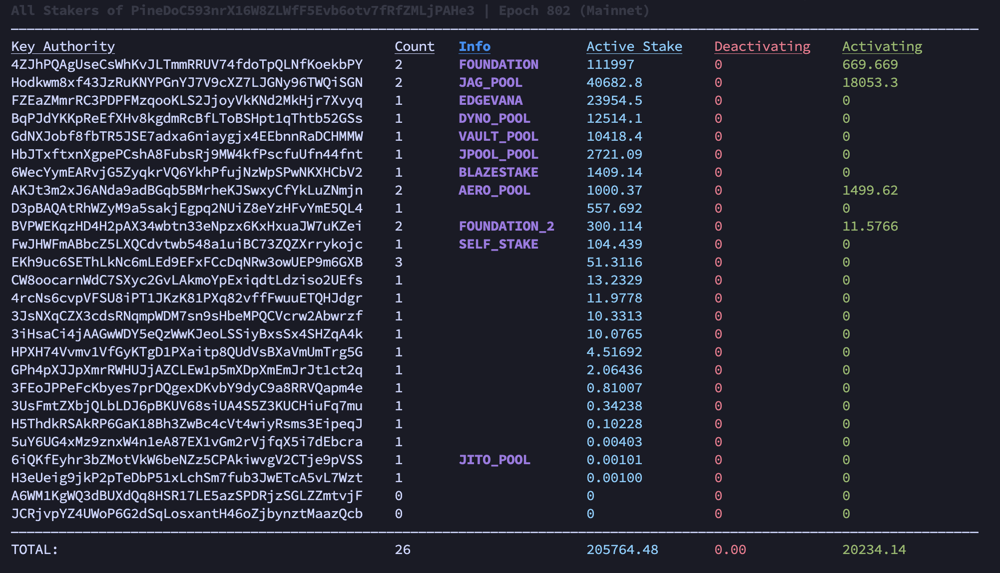

# 🔍 CVK — See Your Stake (v3.0)

A powerful Bash script to display **all stake accounts** for your Solana validator, including active, activating, and deactivating balances.  
Optimized for performance, readability, and large datasets.


---

## ⚙️ Features

- Displays all stakers for your vote account, sorted and colorized
- Aggregates stake by authority (self, pools, SFDP, etc.)
- Calculates:
  - ✅ Active stake
  - ⬇️ Deactivating stake
  - ⬆️ Activating stake
- Works with any cluster (```-um```, ```-ut```, or auto-detect from ```solana config```)
- Retry logic for RPC and CLI queries
- Supports custom sorting (e.g., by stake amount)
- **Dynamic Data Source:** Automatically fetches and caches the latest list of stake pools from the [Solana Stake Pools Research](https://github.com/SOFZP/Solana-Stake-Pools-Research) repository

---

## 📦 Usage

```
bash CVK-see-your-stake_v3.bash [IDENTITY] [CLUSTER] [SORT OPTIONS...]
```

**Examples:**

```
# Auto-detect your validator and cluster  
bash CVK-see-your-stake_v3.bash
```

```
# View a specific identity on testnet, sorted by active stake  
bash CVK-see-your-stake_v3.bash <identity> -ut 4:DESC
```

```
# View a specific identity on mainnet, sorted by active stake and by activating stake   
bash CVK-see-your-stake_v3.bash <identity> -um 4:DESC 6:DESC
```

  

---

## 🧾 Notes

- Requires ```solana-cli``` and ```jq``` to be installed.
- Stake pool authorities are hardcoded from known lists; contributions to expand it are welcome.
- Tested on mainnet and testnet.
- The script uses the `stakepools_list.csv` file from that repository:
➡️ **[View the CSV file here](https://github.com/SOFZP/Solana-Stake-Pools-Research/blob/main/stakepools_list.csv)**
This external data source ensures that as new pools are identified and categorized, the script will automatically benefit from the updates.  

---

## 🛡️ Disclaimer

This script uses **public RPC endpoints** and ```solana``` CLI commands.  
It is provided for informational purposes only.  

---

## 🤝 License & Contributions

MIT License.  
Feel free to fork, improve, or open issues.  
Feedback and pull requests are always appreciated!
